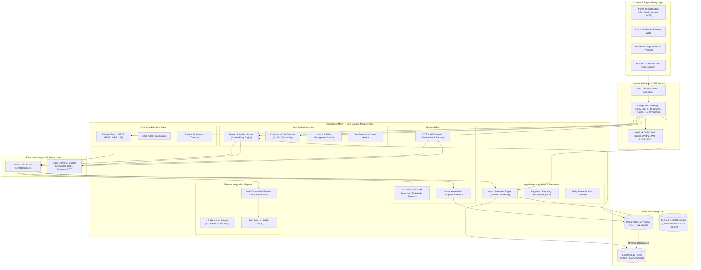
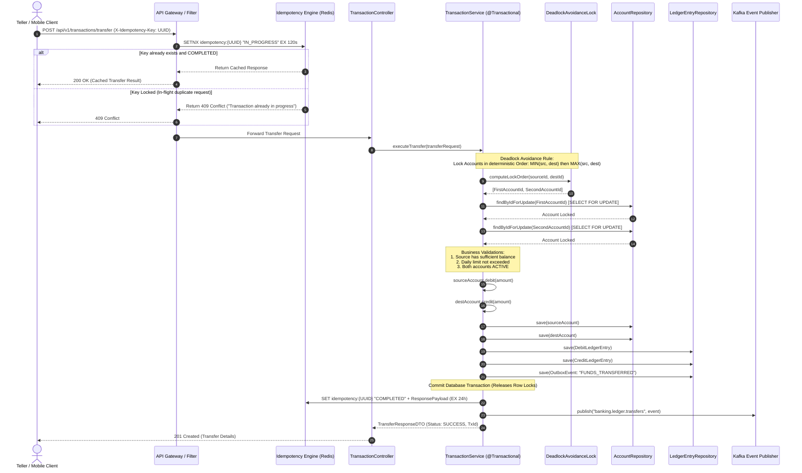
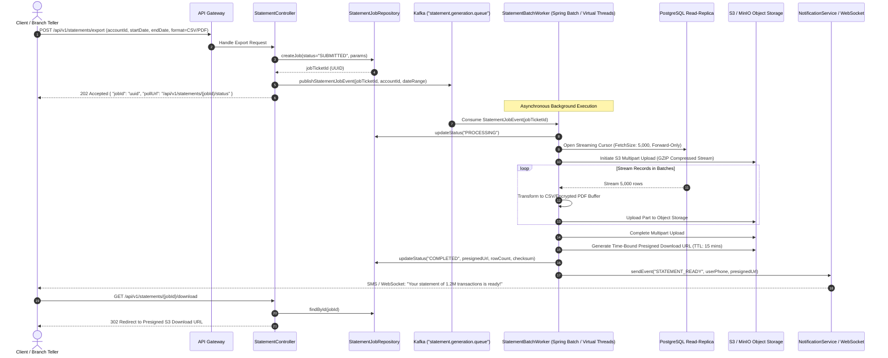
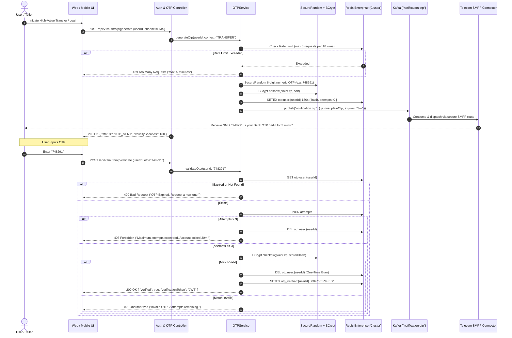
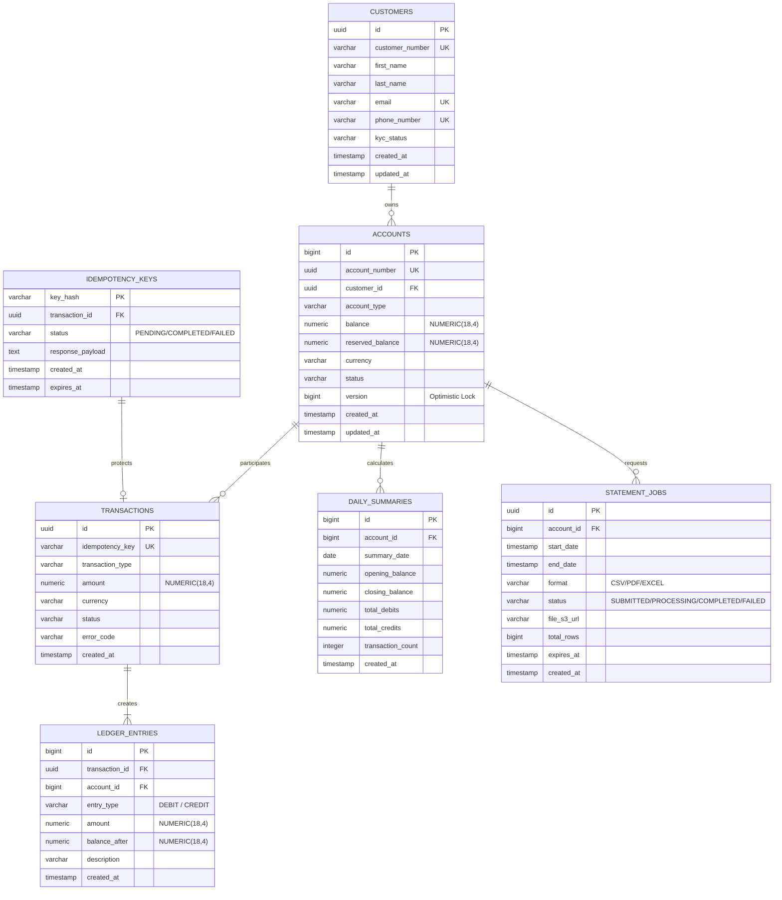

# Enterprise Banking Application — Architecture Blueprint & Technical Specifications
### High-Level Design (HLD), Low-Level Design (LLD) & Production Schema Specification

---

## 1. High-Level Design (HLD)

### 1.1 Architectural Objectives & Constraints
* **Availability & Reliability**: 99.999% uptime (Five Nines), active-active multi-region deployment.
* **Consistency Model**: Strict ACID semantics for core ledger operations; Eventual Consistency for non-financial operations (notifications, audit ingestion, statements).
* **Throughput**: Designed for 15,000+ financial TPS (Transactions Per Second) with p99 latency < 80ms.
* **Compliance & Security**: Strict alignment with PCI-DSS 4.0, ISO 20022 messaging, zero-trust network topology, TLS 1.3 mutual authentication (mTLS), and OAuth2/OIDC RBAC/ABAC.

### 1.2 Enterprise Topology (20 Microservices Ecosystem)



### 1.3 Key Architectural Patterns
1. **CQRS (Command Query Responsibility Segregation)**:
   * **Commands** (Ledger debits/credits, transfers, approvals) hit the Master OLTP database protected by pessimistic row locks.
   * **Queries** (High-volume statement downloads, 50+ column audit reports, balance inquiries) hit Read Replicas and pre-calculated summary tables.
2. **Distributed Idempotency (Strict Once-Only Execution)**:
   * Every non-safe HTTP request requires an `X-Idempotency-Key` header (UUIDv4).
   * Middleware verifies key existence in Redis atomically via `SET NX EX`.
3. **Database-Per-Service & Event-Driven Outbox**:
   * Critical domain events (e.g., `FundsTransferredEvent`) are written to an `outbox` table within the same database transaction as the ledger updates, then published to Kafka via CDC (Debezium) to guarantee zero message loss without two-phase commit overhead.

---

## 2. Low-Level Design (LLD)

### 2.1 Hexagonal (Ports & Adapters) Package Architecture

The core Ledger service follows strict Domain-Driven Design (DDD) with Hexagonal architecture:

```
c:\Users\Admin\OneDrive\Desktop\BankApp
└── src
    └── main
        ├── java
        │   └── com
        │       └── bankapp
        │           ├── domain
        │           │   ├── model          <- Pure business entities (Account, LedgerEntry, Money)
        │           │   ├── exception      <- Domain exceptions (InsufficientFunds, AccountLocked)
        │           │   └── repository     <- Ports: Domain repository interfaces
        │           ├── application
        │           │   ├── service        <- Use case orchestrators (TransferUseCase, StatementUseCase)
        │           │   ├── dto            <- Request/Response records (Immutable contracts)
        │           │   └── port           <- Inbound & Outbound ports
        │           └── infrastructure
        │               ├── adapter
        │               │   ├── rest       <- REST Controllers, Advice, Filter Middleware
        │               │   ├── persistence<- Spring Data JPA repositories, Postgres entities
        │               │   ├── messaging  <- Kafka Event Producers & Consumers
        │               │   └── storage    <- S3/MinIO Object Storage Adapter
        │               └── config         <- Security, Redis, ThreadPool, OpenTelemetry
        └── resources
            ├── db
            │   └── migration              <- Flyway SQL migration scripts (V1, V2, etc.)
            └── application.yml            <- Environment-driven configurations
```

---

### 2.2 Sequence Diagram 1: Two-Phase Fund Transfer (ACID + Deadlock Avoidance)



---

### 2.3 Sequence Diagram 2: Million-Transaction Statement Extraction (Asynchronous Batch Stream)



---

### 2.4 Sequence Diagram 3: Banking-Grade OTP / MOTP Flow



---

## 3. Production Database Schema & ERD Design

### 3.1 Entity Relationship Diagram (ERD)



---

### 3.2 Production PostgreSQL 15+ DDL Specification

```sql
-- =============================================================================
-- BANKING CORE SCHEMA DEFINITIONS (PostgreSQL 15+)
-- Follows strict ACID, double-entry financial ledger and audit compliance
-- =============================================================================

CREATE EXTENSION IF NOT EXISTS "uuid-ossp";
CREATE EXTENSION IF NOT EXISTS "pgcrypto";

-- 1. Customers Table (KYC & Identity)
CREATE TABLE customers (
    id UUID PRIMARY KEY DEFAULT gen_random_uuid(),
    customer_number VARCHAR(32) NOT NULL UNIQUE,
    first_name VARCHAR(64) NOT NULL,
    last_name VARCHAR(64) NOT NULL,
    email VARCHAR(128) NOT NULL UNIQUE,
    phone_number VARCHAR(20) NOT NULL UNIQUE,
    kyc_status VARCHAR(20) NOT NULL DEFAULT 'PENDING' 
        CHECK (kyc_status IN ('PENDING', 'VERIFIED', 'REJECTED', 'SUSPENDED')),
    created_at TIMESTAMPTZ NOT NULL DEFAULT CURRENT_TIMESTAMP,
    updated_at TIMESTAMPTZ NOT NULL DEFAULT CURRENT_TIMESTAMP
);

CREATE INDEX idx_customers_phone ON customers(phone_number);
CREATE INDEX idx_customers_email ON customers(email);

-- 2. Accounts Table (Financial Ledgers)
CREATE TABLE accounts (
    id BIGSERIAL PRIMARY KEY,
    account_number UUID NOT NULL UNIQUE DEFAULT gen_random_uuid(),
    customer_id UUID NOT NULL REFERENCES customers(id) ON DELETE RESTRICT,
    account_type VARCHAR(20) NOT NULL CHECK (account_type IN ('SAVINGS', 'CHECKING', 'LOAN', 'ESCROW')),
    balance NUMERIC(18, 4) NOT NULL DEFAULT 0.0000 
        CHECK (balance >= 0.0000), -- Overdraft requires explicit credit facility
    reserved_balance NUMERIC(18, 4) NOT NULL DEFAULT 0.0000 
        CHECK (reserved_balance >= 0.0000),
    currency VARCHAR(3) NOT NULL DEFAULT 'INR',
    status VARCHAR(20) NOT NULL DEFAULT 'ACTIVE' 
        CHECK (status IN ('ACTIVE', 'FROZEN', 'DORMANT', 'CLOSED')),
    version BIGINT NOT NULL DEFAULT 0, -- Optimistic locking counter
    created_at TIMESTAMPTZ NOT NULL DEFAULT CURRENT_TIMESTAMP,
    updated_at TIMESTAMPTZ NOT NULL DEFAULT CURRENT_TIMESTAMP
);

CREATE INDEX idx_accounts_customer ON accounts(customer_id);
CREATE INDEX idx_accounts_status ON accounts(status);

-- 3. Idempotency Records Table
CREATE TABLE idempotency_records (
    key_hash VARCHAR(64) PRIMARY KEY,
    transaction_id UUID,
    status VARCHAR(20) NOT NULL CHECK (status IN ('PENDING', 'COMPLETED', 'FAILED')),
    response_payload JSONB,
    created_at TIMESTAMPTZ NOT NULL DEFAULT CURRENT_TIMESTAMP,
    expires_at TIMESTAMPTZ NOT NULL
);

CREATE INDEX idx_idempotency_expires ON idempotency_records(expires_at);

-- 4. Transactions Table (Event Root)
CREATE TABLE transactions (
    id UUID PRIMARY KEY DEFAULT gen_random_uuid(),
    idempotency_key VARCHAR(64) NOT NULL UNIQUE,
    transaction_type VARCHAR(32) NOT NULL CHECK (transaction_type IN ('TRANSFER', 'DEPOSIT', 'WITHDRAWAL', 'FEE')),
    amount NUMERIC(18, 4) NOT NULL CHECK (amount > 0),
    currency VARCHAR(3) NOT NULL DEFAULT 'INR',
    status VARCHAR(20) NOT NULL CHECK (status IN ('PENDING', 'SUCCESS', 'FAILED', 'REVERSED')),
    error_code VARCHAR(32),
    created_at TIMESTAMPTZ NOT NULL DEFAULT CURRENT_TIMESTAMP
);

CREATE INDEX idx_transactions_created ON transactions(created_at DESC);

-- 5. Ledger Entries (Double-Entry Bookkeeping: Immutable Append-Only)
-- Range partitioned by created_at (Monthly Partitions for High Volume)
CREATE TABLE ledger_entries (
    id BIGSERIAL,
    transaction_id UUID NOT NULL REFERENCES transactions(id) ON DELETE RESTRICT,
    account_id BIGINT NOT NULL REFERENCES accounts(id) ON DELETE RESTRICT,
    entry_type VARCHAR(6) NOT NULL CHECK (entry_type IN ('DEBIT', 'CREDIT')),
    amount NUMERIC(18, 4) NOT NULL CHECK (amount > 0),
    balance_after NUMERIC(18, 4) NOT NULL,
    description VARCHAR(255) NOT NULL,
    created_at TIMESTAMPTZ NOT NULL DEFAULT CURRENT_TIMESTAMP,
    PRIMARY KEY (id, created_at)
) PARTITION BY RANGE (created_at);

-- Create Initial Partitions
CREATE TABLE ledger_entries_2026_09 PARTITION OF ledger_entries
    FOR VALUES FROM ('2026-09-01 00:00:00+00') TO ('2026-10-01 00:00:00+00');
CREATE TABLE ledger_entries_2026_10 PARTITION OF ledger_entries
    FOR VALUES FROM ('2026-10-01 00:00:00+00') TO ('2026-11-01 00:00:00+00');

CREATE INDEX idx_ledger_account_created ON ledger_entries(account_id, created_at DESC);
CREATE INDEX idx_ledger_tx_id ON ledger_entries(transaction_id);

-- 6. Daily Pre-Aggregated Summary Table (CQRS Read Optimization)
CREATE TABLE daily_account_summary (
    id BIGSERIAL PRIMARY KEY,
    account_id BIGINT NOT NULL REFERENCES accounts(id),
    summary_date DATE NOT NULL,
    opening_balance NUMERIC(18, 4) NOT NULL,
    closing_balance NUMERIC(18, 4) NOT NULL,
    total_debits NUMERIC(18, 4) NOT NULL DEFAULT 0.0000,
    total_credits NUMERIC(18, 4) NOT NULL DEFAULT 0.0000,
    transaction_count INT NOT NULL DEFAULT 0,
    created_at TIMESTAMPTZ NOT NULL DEFAULT CURRENT_TIMESTAMP,
    CONSTRAINT uq_account_date UNIQUE (account_id, summary_date)
);

CREATE INDEX idx_daily_summary_date ON daily_account_summary(account_id, summary_date DESC);

-- 7. High-Volume Statement Export Jobs
CREATE TABLE statement_jobs (
    id UUID PRIMARY KEY DEFAULT gen_random_uuid(),
    account_id BIGINT NOT NULL REFERENCES accounts(id),
    start_date TIMESTAMPTZ NOT NULL,
    end_date TIMESTAMPTZ NOT NULL,
    format VARCHAR(10) NOT NULL CHECK (format IN ('CSV', 'PDF', 'EXCEL')),
    status VARCHAR(20) NOT NULL DEFAULT 'SUBMITTED' 
        CHECK (status IN ('SUBMITTED', 'PROCESSING', 'COMPLETED', 'FAILED')),
    file_s3_url TEXT,
    total_rows BIGINT DEFAULT 0,
    error_message TEXT,
    created_at TIMESTAMPTZ NOT NULL DEFAULT CURRENT_TIMESTAMP,
    expires_at TIMESTAMPTZ NOT NULL
);

CREATE INDEX idx_statement_jobs_account ON statement_jobs(account_id, created_at DESC);
```

---

## 4. Official Online Documentation & Standards References

1. **Spring Boot 3 & Spring Framework Architecture**:
   * *Core Transaction Management*: [Spring Framework Docs — Transaction Management](https://docs.spring.io/spring-framework/reference/data-access/transaction.html)
   * *Declarative Transaction Rollback Rules*: [Spring @Transactional Spec](https://docs.spring.io/spring-framework/docs/current/javadoc-api/org/springframework/transaction/annotation/Transactional.html)
   * *Spring Cloud Gateway*: [Spring Cloud Gateway Docs](https://docs.spring.io/spring-cloud-gateway/reference/)
2. **Enterprise Patterns & Distributed Systems**:
   * *Command Query Responsibility Segregation (CQRS)*: [Martin Fowler — CQRS](https://martinfowler.com/bliki/CQRS.html)
   * *Double-Entry Accounting & Ledger Modeling*: [Martin Fowler — Accounting Transaction](https://martinfowler.com/eaaDev/AccountingTransaction.html)
   * *Microservice Saga Pattern*: [Microservices.io — Saga Pattern](https://microservices.io/patterns/data/saga.html)
   * *Transactional Outbox Pattern*: [Microservices.io — Transactional Outbox](https://microservices.io/patterns/data/transactional-outbox.html)
3. **High-Performance Database & Concurrency**:
   * *PostgreSQL 15 Declarative Partitioning*: [PostgreSQL Official Documentation — Partitioning](https://www.postgresql.org/docs/current/ddl-partitioning.html)
   * *PostgreSQL Concurrency Control & Row Locking (`SELECT FOR UPDATE`)*: [PostgreSQL Concurrency Control](https://www.postgresql.org/docs/current/mvcc.html)
   * *HikariCP Connection Pool Configuration*: [HikariCP GitHub Wiki](https://github.com/brettwooldridge/HikariCP)
4. **Caching, Distributed Locking & Messaging**:
   * *Redis Distributed Locks (Redlock Algorithm)*: [Redis Official Documentation — Distributed Locks](https://redis.io/docs/latest/develop/use/patterns/distributed-locks/)
   * *Apache Kafka Exactly-Once Semantics (EOS)*: [Kafka Official Documentation — Exactly-Once Semantics](https://kafka.apache.org/documentation/#semantics)
   * *Resilience4j Circuit Breakers & Rate Limiters*: [Resilience4j Official User Guide](https://resilience4j.readme.io/docs/circuitbreaker)
5. **Security & Financial Compliance**:
   * *PCI-DSS v4.0 Standard*: [PCI Security Standards Council](https://www.pcisecuritystandards.org/)
   * *OAuth 2.0 & OpenID Connect Core Spec*: [OpenID Foundation Standards](https://openid.net/developers/specs/)
   * *RFC 6238 — TOTP: Time-Based One-Time Password Algorithm*: [IETF RFC 6238](https://datatracker.ietf.org/doc/html/rfc6238)
